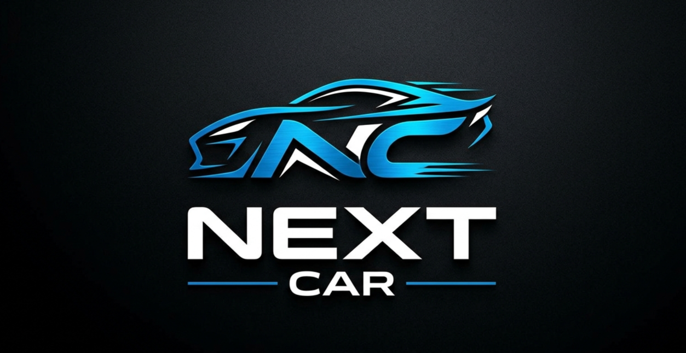
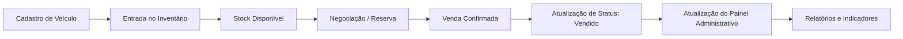
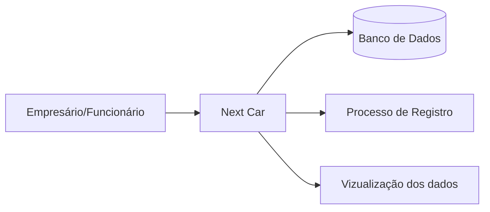
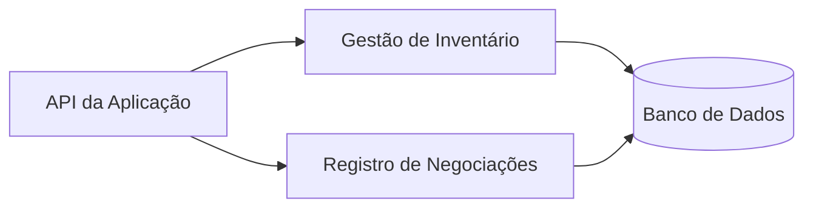

<h1 align="center"> Next Car </h1>

Projeto desenvolvido durante a disciplina de Análise e Projeto de Software.

  <a href="#-documentação">Documentação</a>&nbsp;&nbsp;&nbsp;|&nbsp;&nbsp;&nbsp;
  <a href="#-projeto">Projeto</a>&nbsp;&nbsp;&nbsp;|&nbsp;&nbsp;&nbsp;
  <a href="#-tecnologias">Tecnologias</a>&nbsp;&nbsp;&nbsp;|&nbsp;&nbsp;&nbsp;
  <a href="#%EF%B8%8F-funcionalidades">Funcionalidades</a>&nbsp;&nbsp;&nbsp;|&nbsp;&nbsp;&nbsp;
  <a href="#-fluxo-do-sistema">Fluxo do Sistema</a>&nbsp;&nbsp;&nbsp;|&nbsp;&nbsp;&nbsp;
  <a href="#%EF%B8%8F-arquitetura-c4-model">Arquitetura (C4 Model)</a>&nbsp;&nbsp;&nbsp;|&nbsp;&nbsp;&nbsp;
  <a href="#-estrutura-da-documentação">Estrutura da Documentação</a>&nbsp;&nbsp;&nbsp;|&nbsp;&nbsp;&nbsp;
  <a href="#-integrantes">Integrantes</a>&nbsp;&nbsp;&nbsp;|&nbsp;&nbsp;&nbsp;
  <a href="#-licença">Licença</a>

<!-- 

  <a href="#-documentação">Documentação</a>&nbsp;&nbsp;&nbsp;|&nbsp;&nbsp;&nbsp;
  <a href="#-projeto">Projeto</a>&nbsp;&nbsp;&nbsp;|&nbsp;&nbsp;&nbsp;
  <a href="#-tecnologias">Tecnologias</a>&nbsp;&nbsp;&nbsp;|&nbsp;&nbsp;&nbsp;
  <a href="#%EF%B8%8F-funcionalidades">Funcionalidades</a>&nbsp;&nbsp;&nbsp;|&nbsp;&nbsp;&nbsp;
  <a href="#-fluxo-do-sistema">Fluxo do Sistema</a>

  <a href="#%EF%B8%8F-arquitetura-c4-model">Arquitetura (C4 Model)</a>&nbsp;&nbsp;&nbsp;|&nbsp;&nbsp;&nbsp;
  <a href="#-integrantes">Integrantes</a>&nbsp;&nbsp;&nbsp;|&nbsp;&nbsp;&nbsp;
  <a href="#-estrutura-da-documentação">Estrutura da Documentação</a>&nbsp;&nbsp;&nbsp;|&nbsp;&nbsp;&nbsp;
  <a href="#-licença">Licença</a>

 -->

  

 

  

## 🌐 Documentação

## 💻 Projeto

O Next Car é um sistema desenvolvido para gerenciamento e venda de carros seminovos, criado com o objetivo de aplicar conceitos avançados de Análise e Projeto de Software em um cenário real. O projeto utiliza arquitetura moderna, padrões de design e boas práticas de desenvolvimento, além de métricas e testes automatizados para garantir qualidade, organização e escalabilidade da aplicação.

## 🚀 Tecnologias

Esse projeto foi desenvolvido com as seguintes tecnologias:

- Java
- Spring Boot
- MySQL
- IntelliJ
- Postman
- Git e Github

## 🛠️ Funcionalidades

- Gestão de Inventário: Registo completo de veículos, incluindo marca, modelo, ano, quilometragem e especificaçõesoes técnicas.
- Módulo de Vendas: Fluxo estruturado para o registo de transaçõoes e histórico de negociações.
- Painel Administrativo: Visualização rápida de métricas de entrada e saída, facilitando o controlo do stock.
- Interface Otimizada: Foco na experiência do utilizador para agilizar o processo de gestão e venda.

## 🧭 Fluxo do Sistema

## 🏗️ Arquitetura (C4 Model)

## Contexto do Sistema

## Containers

## Componentes

## 📂 Estrutura da Documentação

## 👨‍💻 Integrantes

<table>
  <tr>
    <td align="center">
       
      <a href="https://www.linkedin.com/in/emerson-willian-19984630b/" target="_blank">
        <b>Emerson Dias</b>
      </a>
    </td>
    <td align="center">
       
      <a href="https://www.linkedin.com/in/lucas-hudson-1245bb409/" target="_blank">
        <b>Lucas Hudson</b>
      </a>
    </td>
    <td align="center">
       
      <a href="https://www.linkedin.com/in/maria/" target="_blank">
        <b>Marcela Cantalice</b>
      </a>
    </td>
    <td align="center">
       
      <a href="https://www.linkedin.com/in/marcos-dalyson-9457373b3?utm_source=share_via&utm_content=profile&utm_medium=member_android" target="_blank">
        <b>Marcos Dalyson</b>
      </a>
    </td>
    <td align="center">
       
      <a href="https://www.linkedin.com/in/mateus-oliveira-172492213" target="_blank">
        <b>Mateus Oliveira</b>
      </a>
    </td>
    <td align="center">
       
      <a href="https://www.linkedin.com/in/rosalvo-alves-de-oliveira-filho-928521391/" target="_blank">
        <b>Rosalvo Alves</b>
      </a>
    </td>
      </a>
    </td>
  </tr>
</table>

## 📝 Licença

Esse projeto está sob a licença MIT.
